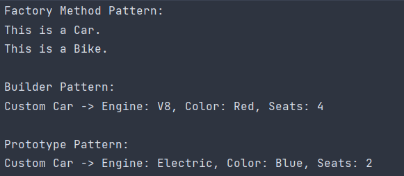

# Creational Design Patterns

## Author: Timciuc Ana-Maria

---

## Objectives:

* Understand and practice Creational Design Patterns (CDPs).
* Select a domain for a small project.
* Implement at least 3 CDPs for the selected project.

---

## Used Design Patterns:

* Factory Method
* Builder
* Prototype

---

## Implementation

* **Domain**: A simple Vehicle Manufacturing System that creates different vehicles (like cars and bikes), allows custom configurations, and clones existing configurations.

* **Explanation**: This system uses three patterns to manage different needs:
    - **Factory Method**: To create vehicles without specifying their exact type.
    - **Builder**: To allow detailed customization of vehicles.
    - **Prototype**: To clone a vehicle with a specific configuration.

### Factory Method
```csharp
abstract class VehicleFactory {
    public abstract Vehicle CreateVehicle();
}

class CarFactory : VehicleFactory {
    public override Vehicle CreateVehicle() => new Car();
}

class BikeFactory : VehicleFactory {
    public override Vehicle CreateVehicle() => new Bike();
}
```

### Builder Pattern
```csharp
interface IVehicleBuilder {
    void SetEngine(string engine);
    void SetColor(string color);
    void SetSeats(int seats);
    Vehicle GetVehicle();
}

class CarBuilder : IVehicleBuilder {
    private CustomCar _car = new CustomCar();

    public void SetEngine(string engine) => _car.Engine = engine;
    public void SetColor(string color) => _car.Color = color;
    public void SetSeats(int seats) => _car.Seats = seats;
    public Vehicle GetVehicle() => _car;
}
```

### Prototype Pattern
```csharp
abstract class VehiclePrototype {
    public abstract VehiclePrototype Clone();
}

class CustomCar : VehiclePrototype {
    public string Engine { get; set; }
    public string Color { get; set; }
    public int Seats { get; set; }

    public override VehiclePrototype Clone() {
        return new CustomCar {
            Engine = this.Engine,
            Color = this.Color,
            Seats = this.Seats
        };
    }
}
```

### Usage Example (Main Program)
```csharp
class Program {
    static void Main() {
        VehicleFactory carFactory = new CarFactory();
        Vehicle car = carFactory.CreateVehicle();
        car.DisplayInfo();

        IVehicleBuilder carBuilder = new CarBuilder();
        VehicleDirector director = new VehicleDirector();
        Vehicle customCar = director.Construct(carBuilder);
        customCar.DisplayInfo();

        CustomCar prototypeCar = new CustomCar { Engine = "Electric", Color = "Blue", Seats = 2 };
        CustomCar clonedCar = (CustomCar)prototypeCar.Clone();
        clonedCar.DisplayInfo();
    }
}
```

---

## Conclusions / Screenshots / Results

- The **Factory Method** makes it simple to create different types of vehicles by letting factories handle the object creation.
- The **Builder Pattern** allows the configuration of complex vehicle options step-by-step, like engine type, color, and number of seats.
- The **Prototype Pattern** enables cloning of custom-configured vehicles, which is efficient if configurations need to be reused often. 


